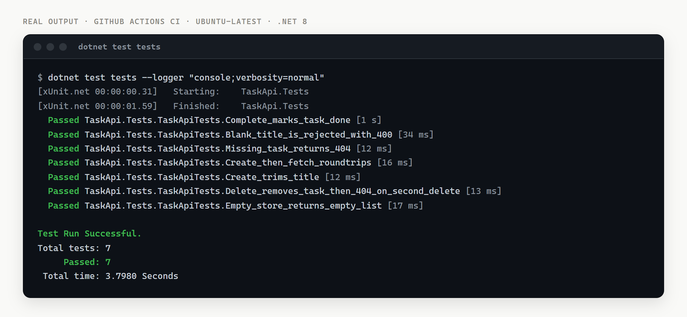

# aspnet-minimal-api

[](https://github.com/zahid23saim/aspnet-minimal-api/actions/workflows/ci.yml)


[](LICENSE)

A small, complete **ASP.NET Core Minimal API** (.NET 8) — a task-tracker with full
CRUD, input validation, correct HTTP status codes, and **integration tests that
exercise the real endpoints** in memory. It is intentionally compact: one
`Program.cs` you can read top to bottom, and a test project that proves it works.



Minimal APIs let you define endpoints as small lambdas instead of controllers,
which keeps a service like this readable in a single file while still returning
proper status codes (`201 Created` with a `Location` header, `400` for bad input,
`404` for missing resources, `204` on delete).

## Endpoints

| Method | Route | Behaviour |
|--------|-------|-----------|
| `GET` | `/tasks` | List all tasks, ordered by id |
| `GET` | `/tasks/{id}` | One task, or `404` |
| `POST` | `/tasks` | Create; validates title, returns `201` + `Location` |
| `PUT` | `/tasks/{id}/complete` | Mark done, or `404` |
| `DELETE` | `/tasks/{id}` | `204` if removed, `404` if it wasn't there |

The store is an in-memory `ConcurrentDictionary` so the project runs with zero
setup. Swapping it for **Entity Framework Core + a database** is a drop-in change
that leaves the endpoint shapes untouched.

## Run it

Requires the [.NET 8 SDK](https://dotnet.microsoft.com/download).

```bash
dotnet run --project src
```

Then, in another terminal:

```bash
# create a task
curl -s -X POST http://localhost:5000/tasks \
     -H "Content-Type: application/json" \
     -d '{"title":"write tests"}'

# list tasks
curl -s http://localhost:5000/tasks

# mark it done
curl -s -X PUT http://localhost:5000/tasks/1/complete
```

(The exact port is printed on startup.)

## Test it

The tests use `WebApplicationFactory<Program>` to boot the whole app in memory and
call the endpoints over real HTTP — no mocks, no running server. A fresh factory
per test gives each test its own store, so they stay isolated.

```bash
dotnet test tests
```

```
Passed!  -  Failed: 0, Passed: 7, Skipped: 0, Total: 7
```

The suite covers the happy paths (create → fetch, complete, delete) and the edges
that are easy to get wrong: a blank title is rejected with `400`, a title is
trimmed on create, a missing id returns `404`, and deleting the same task twice
returns `204` then `404`.

## Layout

```
src/    TaskApi.csproj    Program.cs      -- the API (one file)
tests/  TaskApi.Tests.csproj  TaskApiTests.cs  -- xUnit integration tests
```

## Background

A companion write-up of the design decisions is here:
[Building a Tested ASP.NET Core Minimal API in One File](https://dev.to/zahid23saim/building-a-tested-aspnet-core-minimal-api-in-one-file-20c1).

## License

MIT — see [LICENSE](LICENSE).
